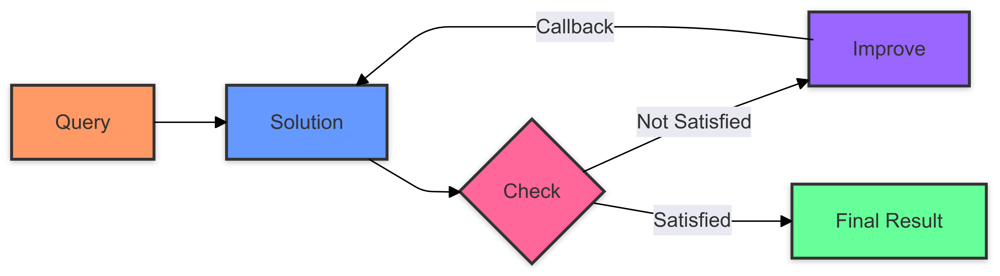

[](https://github.com/femto/minion) 
[](https://github.com/femto/minion#get-started) 
[](https://discord.gg/HUC6xEK9aT)
[](https://x.com/femtowin)

# Minion README

## Features

Minion is Agent's Brain. Minion is designed to execute any type of queries, offering a variety of features that demonstrate its flexibility and intelligence.


## Working Principle

The following flowchart illustrates how Minion collaborates:



The flowchart demonstrates the complete process from query to final result:
1. First receives the user query (Query)
2. System generates a solution (Solution)
3. Performs solution verification (Check)
4. If unsatisfactory, makes improvements (Improve) and returns to generate new solutions
5. If satisfactory, outputs the final result (Final Result)

## Benchmarks

Minion has achieved impressive results on various benchmarks:

- GSM8K: 96% accuracy using DeepSeek-Chat
- Game of 24: 100% success rate on the 20 most difficult problems
  (These were selected by running the TOT Game24 CSV from the most difficult backwards. The last problem had a 20.70% success rate, and the second to last had a 26.90% success rate.)
- AIME 2024: 26% success rate (4 out of 15 tasks completed successfully)
- Humaneval: 98.2% pass@1 rate using gpt-4o

## InProgress

Minion supports processing various benchmarks through configurable workflows. You can find examples in:
- `examples/smart_minion/gsm8k/`: Math word problem solving
- `examples/smart_minion/code_contests/`: Code competition problem solving

#### Configuration-based Workflow

Each benchmark can be configured using a JSON configuration file that defines the processing pipeline. For example, `examples/smart_minion/code_contests/code_contests_config.json` demonstrates an ensemble approach:

```json
{
  "type": "ensemble",
  "pre_processing": ["problem_reflect", "example_reasoning"],
  "workers": [
    {
      "name": "python",
      "count": 3,
      "check": 1,
      "check_route": "codium_check",
      "post_processing": "extract_python"
    }
  ],
  "result_strategy": {
    "name": "majority_voting"
  }
}
```

This configuration allows you to define:
- Pre-processing steps for problem analysis
- Multiple worker configurations for ensemble solutions
- Verification and post-processing steps
- Result aggregation strategies

You can create similar configurations for your own benchmarks by following these examples.

## Minion Design

The core logic of Minion is implemented in `examples/smart_minion/brain.py`. You can experiment with different examples by modifying the code, as various scenarios are commented out for easy testing.

## Quick Demo

Check out this quick demo video to see Minion in action:

[](https://youtu.be/-LW7TCMUfLs?si=-pL9GhNfbjFtNagJ)

**Note:** The image above is a clickable link. Click on it to watch the demo video on YouTube.

## Example Usage

```python
obs, score, *_ = await brain.step(query="what's the solution 234*568")
print(obs)

obs, score, *_ = await brain.step(query="what's the solution for game of 24 for 4 3 9 8")
print(obs)

obs, score, *_ = await brain.step(query="what's the solution for game of 24 for 2 5 11 8")
print(obs)

obs, score, *_ = await brain.step(query="solve x=1/(1-beta^2*x) where beta=0.85")
print(obs)

obs, score, *_ = await brain.step(
    query="Write a 500000 characters novel named 'Reborn in Skyrim'. "
          "Fill the empty nodes with your own ideas. Be creative! Use your own words!"
          "I will tip you $100,000 if you write a good novel."
          "Since the novel is very long, you may need to divide it into subtasks."
)
print(obs)

cache_plan = os.path.join(current_file_dir, "aime", "plan_gpt4o.1.json")
obs, score, *_ = await brain.step(
    query="Every morning Aya goes for a $9$-kilometer-long walk and stops at a coffee shop afterwards. When she walks at a constant speed of $s$ kilometers per hour, the walk takes her 4 hours, including $t$ minutes spent in the coffee shop. When she walks $s+2$ kilometers per hour, the walk takes her 2 hours and 24 minutes, including $t$ minutes spent in the coffee shop. Suppose Aya walks at $s+\frac{1}{2}$ kilometers per hour. Find the number of minutes the walk takes her, including the $t$ minutes spent in the coffee shop.",
    route="cot",
    dataset="aime 2024",
    cache_plan=cache_plan,
)
print(obs)

cache_plan = os.path.join(current_file_dir, "aime", "plan_gpt4o.7.json")

obs, score, *_ = await brain.step(
    query="Find the largest possible real part of\[(75+117i)z+\frac{96+144i}{z}\]where $z$ is a complex number with $|z|=4$.",
    route="cot",
    dataset="aime 2024",
    cache_plan=cache_plan,
)
print(obs)

```
## Get Started

### Installation

```
git clone https://github.com/femto/minion.git && cd minion && pip install -r requirements.txt
cp config/config.yaml.example config/config.yaml
cp config/.env.example config/.env
```
then edit config/config.yaml
```
models:
  "default":
    api_type: "openai"
    base_url: "${DEFAULT_BASE_URL}"
    api_key: "${DEFAULT_API_KEY}"
    model: "deepseek-chat"
    temperature: 0
```
then config/.env
```
DEFAULT_API_KEY=sk-xxx
DEFAULT_BASE_URL=base_url
DEFAULT_MODEL=deepseek-chat
```

### Other Dependencies
#### Using Brain with docker python env
```
docker build -t intercode-python -f docker/python.Dockerfile .
```
```
brain = Brain() #default will use docker python env
```

#### Using Brain with rpyc env(If you don't want to use docker)
```
python docker/utils/python_server.py --port 3007
```
```
brain = Brain(python_env=RpycPythonEnv(port=3007))
```
#### Using Brain with Local Python env(be aware of this method, since llm can generate bad code)
```
brain = Brain(python_env=LocalPythonEnv(verbose=False))
```
#### Troubleshooting with docker python env
#### stop existing container if necessary
```
docker stop intercode-python_ic_ctr
docker rm intercode-python_ic_ctr
docker run -d -p 3006:3006 --name intercode-python_ic_ctr intercode-python
```
make sure container name intercode-python_ic_ctr is listening on 3006

## Community and Support

Join our Discord community to connect with other Minion users, get support, and stay updated on the latest developments:

[](https://discord.gg/HUC6xEK9aT)

Follow the project creator on Twitter for announcements and insights:

[](https://x.com/femtowin)

## Enjoy Your Brain.Step() Journey

Then enjoy you brain.step("some requirement") journey
currently game of 24 and solve equation can reach near 100% accuracy,
while writing novel can generate plan, I'm still writing what's left.

